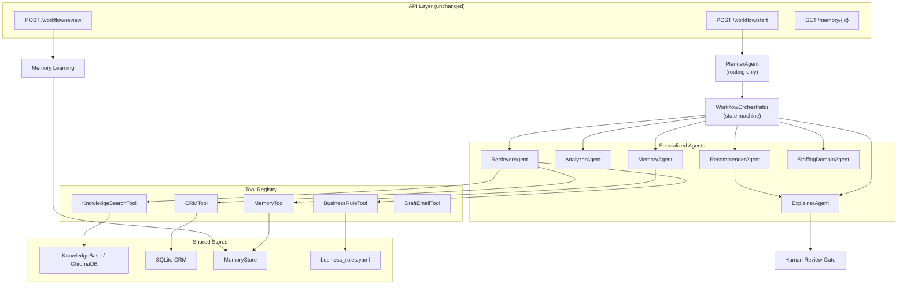

A polished, judge-friendly demo experience with a premium visual identity and a storytelling-driven interaction layer.

Run:
```bash
docker compose up --build
```

Highlights:
- Premium visual direction with a cinematic, editorial feel
- Dynamic planner recommendations with a more human, narrative tone
- A persistent "spark" experience that lets the demo feel memorable

Backend: http://localhost:8000/docs
Frontend: http://localhost:3000

---

## Layer 1 Completed

Layer 1 deepens business intelligence and **robust dynamic ingestion** without changing architecture or breaking existing flows (ingestion, planner orchestration, human-in-the-loop review, memory, frontend compatibility).

### What improved

| Area | Change |
|------|--------|
| **Dynamic ingestion** | `CustomerInteraction` input schema supports raw text, email (subject/from/body), transcripts (`Speaker: text`), and meeting notes (date/context/notes). `_preprocess_interaction` detects format and extracts participants, topics, action items, sentiment, and open questions |
| **MockKnowledge** | 12 SaaS Sales entries (3 articles, 3 playbooks, 3 product docs, 3 CRM events) + 7 Customer Success entries with detailed excerpts for evidence linking |
| **Business analysis** | Nuanced keyword heuristics + ingestion enrichment (participants, open questions, sentiment) + memory bias from past approvals/rejections |
| **Recommendations** | 2–4 scenario-specific Next Best Actions with relevance-scored evidence and calibrated confidence (0.55–0.92) |
| **Success metrics** | Domain KPIs on `WorkflowStartResult.success_metrics` and `explanation_bundle.success_metrics` |
| **Memory & learning** | `learn_from_outcome` stores KPI snapshots; `get_memory` returns insights, approval rate, and KPI history |

### Example inputs (`examples/`)

Three ready-to-run payloads:

```bash
# Email-style input
curl -s -X POST http://localhost:8000/workflow/start \
  -H "Content-Type: application/json" \
  -d @examples/email_input.json | python3 -m json.tool

# Transcript-style input (Speaker: lines)
curl -s -X POST http://localhost:8000/workflow/start \
  -H "Content-Type: application/json" \
  -d @examples/transcript_input.json | python3 -m json.tool

# Meeting notes with date + attendees
curl -s -X POST http://localhost:8000/workflow/start \
  -H "Content-Type: application/json" \
  -d @examples/meeting_notes_input.json | python3 -m json.tool
```

**Ingestion enrichment in response** (`explanation_bundle.ingestion_enrichment`):

```json
{
  "detected_format": "email",
  "participants": ["Jordan Lee, VP Operations <jordan.lee@acmecorp.com>"],
  "topics": ["reporting pain", "champion gap", "competitive", "security", "timeline"],
  "action_items_mentioned": ["a mutual action plan by end of month"],
  "sentiment": "mixed",
  "open_questions": ["Who on your side can help us build an internal business case?"]
}
```

### Example: SaaS Sales workflow start (raw text — still supported)

```bash
curl -s -X POST http://localhost:8000/workflow/start \
  -H "Content-Type: application/json" \
  -d '{
    "customer_id": "CUST-1001",
    "domain": "saas_sales",
    "source_type": "meeting_notes",
    "interaction_text": "VP Ops wants faster reporting (4hr manual). No champion yet. Competitor X mentioned. IT asked about SSO."
  }' | python3 -m json.tool
```

**Sample output (abbreviated):**

```json
{
  "success_metrics": {
    "win_probability": {
      "current_estimate": "58%",
      "estimated_impact": "Win Probability: +3% with top action",
      "interpretation": "Based on champion status, pain quantification, and playbook alignment."
    },
    "time_to_champion": {
      "current_estimate": "9 days",
      "estimated_impact": "Time-to-Champion: -5 days with MAP + enablement kit"
    }
  },
  "next_best_actions": [
    {
      "title": "Send a mutually agreed action plan (MAP) draft",
      "confidence": 0.86,
      "evidence": [
        { "label": "Mutual action plan (MAP) after discovery", "source": "playbook:PB-SAAS-01" },
        { "label": "Discovery call: VP Ops wants faster reporting...", "source": "crm_event:CRM-SAAS-1" }
      ],
      "rationale": "MAP acceptance correlates with +25% win probability (PB-SAAS-01)... Evidence: PB-SAAS-01, CRM-SAAS-1."
    },
    {
      "title": "Initiate security fast-track packet (SOC2 + SSO)",
      "confidence": 0.88
    }
  ],
  "explanation_bundle": {
    "success_metrics": { "...": "..." },
    "natural_language_summary": "Proposed path: Quantify the reporting/workflow pain... Expected impact: Win Probability: +3% with top action."
  }
}
```

### Example: Memory after approval

```bash
# Approve a run (use review_id from workflow/start response)
curl -s -X POST http://localhost:8000/workflow/review \
  -H "Content-Type: application/json" \
  -d '{"review_id": "<REVIEW_ID>", "status": "approved", "reviewer_notes": "MAP approach worked last time"}'

# Check learned insights
curl -s http://localhost:8000/memory/CUST-1001 | python3 -m json.tool
```

**Sample memory response:**

```json
{
  "learned_insights": [
    "Past approvals favor: Send a mutually agreed action plan (MAP) draft (1 approved run(s) on record).",
    "Observed KPI movement on 'win_probability': Win Probability: +3% with top action (latest approved run)."
  ],
  "outcome_summary": { "total_runs": 1, "approved": 1, "rejected": 0, "approval_rate": 1.0 },
  "kpi_history": { "win_probability": ["Win Probability: +3% with top action"] }
}
```

### Sample interaction scenarios

1. **SaaS — reporting pain + no champion + competitor** → MAP draft, champion follow-up, POV sprint, security packet (when SSO mentioned)
2. **SaaS — sparse context** → stakeholder alignment call + qualification email
3. **Customer Success — tickets + usage dip** → 30-day recovery plan, health narrative, workflow discovery session

Re-run the same customer after approval to see memory-biased confidence and analysis adjustments.

---

## Layer 2 Completed: Real Retrieval & Multi-Source Reasoning

Layer 2 modernizes the knowledge base with real file ingestion, an SQLite CRM database simulation, dynamic configurable rules, and a **Dual-Engine Vector Store** featuring ChromaDB and Sentence-Transformers (with a zero-dependency, pure-Python TF-IDF cosine-similarity fallback).

### What improved

| Area | Change |
|------|--------|
| **Knowledge Base Ingestion** | Dynamic loaders in `KnowledgeBase` parse real files from `backend/knowledge/` (supporting YAML/JSON structure) for articles, playbooks, and product documentation. |
| **Dual-Engine Vector Store** | Ephemeral ChromaDB client embeds and indexes documents using `all-MiniLM-L6-v2`. If ChromaDB/PyTorch fail to install or initialize, the system seamlessly falls back to a pure-Python TF-IDF vectorizer + Cosine Similarity search. |
| **SQLite CRM Simulator** | CRM updates are seeded and stored in a local SQLite database (`crm.db`) on startup. Planner queries this simulator via customer ID to trace actual account history. |
| **Configurable Business Rules** | Domain rules, priorities, minimum relevance filters, and confidence clamps are managed in `backend/config/business_rules.yaml`. The Planner respects these parameters. |
| **Grounded Citations & Relevance** | Rationale for recommendations explicitly cites retrieved documents and their relevance score (e.g., `PB-SAAS-03 (Relevance: 0.51)`). |

### Example Query and Retrieved Evidence

Request:
```bash
curl -s -X POST http://127.0.0.1:8000/workflow/start \
  -H "Content-Type: application/json" \
  -d '{
    "customer_id": "CUST-1001",
    "domain": "saas_sales",
    "interaction_text": "discovery and mutual action plan security SOC2 review SSO crm sync competitor"
  }' | python3 -m json.tool
```

Sample output:
```json
{
  "next_best_actions": [
    {
      "title": "Initiate security fast-track packet (SOC2 + SSO)",
      "confidence": 0.73,
      "evidence": [
        {
          "label": "Mutual action plan (MAP) after discovery",
          "excerpt": "...",
          "source": "playbook:PB-SAAS-03",
          "relevance": 0.51
        }
      ],
      "rationale": "Delayed security responses are the #2 slip reason (PB-SAAS-03). DOC-SAAS-SSO shows 8-day average review when packet is complete upfront. Grounded in: PB-SAAS-03 (Relevance: 0.51), CRM-SAAS-2 (Relevance: 1.00)."
    }
  ]
}
```

### New Setup Instructions

All dependencies (including `chromadb`, `sentence-transformers`, `PyYAML`, `scikit-learn`, `numpy`) are defined in `backend/requirements.txt`.
To start the services:
```bash
docker compose up --build
```
On startup, the backend automatically initializes and seeds `crm.db` and downloads/sets up the semantic search embeddings model. If the environment does not support compiling/downloading large machine learning wheels, it falls back to the lightweight built-in TF-IDF engine.

---

## LLM Provider Enhancement (Ollama & Groq API)

The planner can now enhance the business analysis step and Next Best Action recommendations with a fast cloud LLM (Groq API) or local model (Ollama), while keeping the existing rule-based analyzer and recommendation templates as reliable fallbacks.

### Choosing your LLM Provider
Set the environment variable `LLM_PROVIDER` to either `groq` or `ollama`. By default, it uses `ollama`.

#### 1. Cloud-Based Option (Groq API)
To use Groq, set the following environment variables:
- `LLM_PROVIDER=groq`
- `GROQ_API_KEY=your_groq_api_key`
- `GROQ_MODEL` (Optional, defaults to `llama-3.3-70b-versatile`)

Example to start the project with Groq:
```bash
GROQ_API_KEY=your_api_key LLM_PROVIDER=groq docker compose up --build
```
> [!NOTE]
> If `GROQ_API_KEY` is not provided or if the Groq health check fails, the platform automatically falls back to Ollama. If Ollama is also unavailable, it falls back to the deterministic rule-based engine.

#### 2. Local Option (Ollama)
By default, `PlannerAgent` uses `llama3.2` model. Choose another model with:

```bash
OLLAMA_MODEL=mistral docker compose up --build
```

For local enhancement, install and run Ollama separately, then pull the default model:

```bash
ollama pull llama3.2
ollama serve
```

When running the backend in Docker and Ollama on the host, set `OLLAMA_HOST` if needed:

```bash
OLLAMA_HOST=http://host.docker.internal:11434 docker compose up --build
```

Fallback behavior means these LLM options are optional; `docker compose up --build` remains fully runnable using the rule-based fallback when no LLMs are active.

### Ollama troubleshooting

Check host Ollama first:

```bash
ollama list
ollama pull llama3.2
ollama serve
```

Then verify backend connectivity:

```bash
curl -s http://localhost:8000/ollama/health | python3 -m json.tool
```

Expected healthy response fields:

```json
{
  "ok": true,
  "model": "llama3.2",
  "model_available": true,
  "planner_enabled": true
}
```

Useful backend logs:

```text
[Ollama] Health check success host=http://host.docker.internal:11434 model=llama3.2 model_available=True
[Ollama] Planner enabled host=http://host.docker.internal:11434 model=llama3.2
[Ollama] Success analysis model=llama3.2
[Ollama] Success recommendations model=llama3.2
```

If you see `[Ollama] Connection failed`, confirm Ollama is running on the host and that Docker Compose includes `OLLAMA_HOST=http://host.docker.internal:11434`. If `model_available` is false, run `ollama pull llama3.2` or set `OLLAMA_MODEL` to a model shown by `ollama list`.

---

## Layer 3 Completed: Advanced Agent Orchestration & Extensibility

Layer 3 transforms `PlannerAgent` into a reusable orchestration engine. The Planner **never performs business reasoning directly** — it decides *what* runs, *in which order*, and *why*, based on confidence, interaction type, and domain.

### Architecture



### Workflow state machine

Explicit transitions (no nested function calls):

| State | Description |
|-------|-------------|
| `INGESTED` | Raw payload received |
| `PREPROCESSED` | Format detection + enrichment |
| `ANALYZED` | Business context, risks, opportunities |
| `RETRIEVED` | Knowledge + CRM + rules |
| `RECOMMENDED` | Next Best Actions |
| `EXPLAINED` | Executive narrative |
| `WAITING_REVIEW` | Human gate |
| `APPROVED` → `LEARNING` → `COMPLETED` | Post-review learning loop |

### Dynamic routing

| Route | When | Agents run |
|-------|------|------------|
| **full** | Standard meeting notes / email | memory → analyzer → retriever → recommender → explainer |
| **fast_faq** | Short FAQ-style question | retriever → explainer |
| **deep** | Low confidence (negative sentiment, sparse context) | Full pipeline with extra memory bias |
| **staffing** | `domain: staffing` | memory → staffing_domain → analyzer → retriever → recommender → explainer |

### Agent trace

Every `/workflow/start` response includes `explanation_bundle.agent_trace`:

```json
{
  "agent_trace": [
    {
      "agent_name": "analyzer",
      "execution_order": 2,
      "duration_ms": 12.4,
      "confidence": 0.78,
      "decision": "analyzed",
      "reason": "Detected 5 signals; 3 information gaps",
      "tool_usage": []
    }
  ],
  "orchestration": {
    "route": "full",
    "routing_reason": "Standard enterprise interaction pipeline"
  }
}
```

The frontend visualizes this trace in the **Agent orchestration trace** panel.

### How to add a new agent

1. Create `backend/orchestration/agents/my_agent.py` extending `BaseAgent`
2. Register with one line in `register_default_agents()`:

```python
AgentRegistry.register("my_agent", MyAgent(engine))
```

3. Add the agent name to a workflow in `register_default_workflows()`

### How to register a tool

```python
tool_registry.register(MyTool(dependency))
```

Tools implement `BaseTool`: `execute()`, `metadata()`, `health()`.

### How to add a domain (Staffing example)

Without modifying `PlannerAgent`:

1. Add rules to `backend/config/business_rules.yaml`
2. Add knowledge to `backend/knowledge/*.yaml`
3. Create `backend/orchestration/domains/staffing/agent.py`
4. Register in `register_default_agents()` and `register_default_workflows()`

```bash
curl -s -X POST http://localhost:8000/workflow/start \
  -H "Content-Type: application/json" \
  -d '{
    "customer_id": "CUST-STAFF-01",
    "domain": "staffing",
    "interaction_text": "Urgent RN req — need submittals by Friday. Background check pending."
  }' | python3 -m json.tool
```

### Project structure (Layer 3)

```
backend/
├── ai_platform.py          # Backward-compatible facade + decision engine
├── main.py                 # Unchanged API endpoints
├── orchestration/
│   ├── agents/             # Analyzer, Retriever, Recommender, Explainer, Memory
│   ├── tools/              # KnowledgeSearch, CRM, Memory, BusinessRules, DraftEmail
│   ├── registries/         # AgentRegistry, ToolRegistry, WorkflowRegistry
│   ├── workflow/           # State machine + WorkflowOrchestrator
│   └── domains/staffing/   # Domain extension example
└── tests/test_orchestration.py
```

### Run tests

```bash
cd backend
python -m unittest tests.test_orchestration -v
```

Tests cover: workflow transitions, agent/tool registries, planner orchestration, agent trace, dynamic routing, and staffing domain.

### Backward compatibility

All existing endpoints, response shapes, retrieval, memory, business rules, Ollama integration, and human review remain unchanged. Layer 3 refactors **internally** — clients and the frontend continue to work without modification (with added trace visualization).

---

## Layer 4 Completed: UX & Human-in-the-Loop Polish

Layer 4 introduces a state-of-the-art decision intelligence command center. The new UI tells the complete end-to-end story:

```
Customer Input ➔ AI Enrichment ➔ Planner Agent ➔ Specialized Agents ➔ Enterprise Retrieval ➔ Recommendations ➔ Human Review ➔ Org Memory
```

### Key UI Capabilities

1. **Enterprise Input Workspace**: Dynamic tabbed forms for Meeting Notes, Emails, Transcripts, CRM activities, and Conversations. Features automatic layout rendering matching each source format.
2. **AI Enrichment Panel**: Displays ingestion metadata including detected formats, entities, checklist items, and inferred sentiments with beautiful visual HSL badges and emoji alerts.
3. **Workflow Engine Visualization**: Real-time state machine node graphs reflecting backend specialized agent execution (e.g. MemoryAgent, AnalyzerAgent, RetrieverAgent, etc.) dynamically adapting depending on Planner routes.
4. **Agent Trace Explorer**: Auditable breakdown log of agent durations, tool usage details, and granular decisions.
5. **Recommendation Workspace**: Rendered as premium action boards featuring business metrics, citations, and inline editing for immediate simulation.
6. **Evidence Explorer**: Relevance metrics visualizer and collapsible enterprise document excerpt viewers.
7. **Human Review Center**: Integrated console connecting directly to `/workflow/review` to commit decisions (Approve, Reject, Modify-and-rerun) to memory store.
8. **Clarifying Questions Console**: Dynamic input sheets requesting responses to missing information before approval, allowing inline answers and instant resubmission without a page refresh.
9. **Intelligence Dashboards**: Combined Executive KPI rings (Win Probabilities, Churn Risk, Approval Rates, confidence) and Memory logs tracking continual improvement statistics.
10. **Aesthetics & Modes**: Cinematic dark mode default, fully responsive layout grids, loading skeletons, and interactive dark/light toggling.


---

## Layer 5 Completed: Production-Ready + Innovation

Layer 5 upgrades Decisio-AI to a production-ready agentic decision intelligence platform, introducing structured persistence, a metric-driven evaluation runner, automated downstream execution stubs, and clean extensibility patterns.

### 1. Persistence Layer (SQLite Database)
Decisio-AI has replaced the MVP's volatile in-memory storage with persistent storage built on SQLite, sharing the `crm.db` database inside the backend container. 

The tables created and maintained are:
- `interactions`: Persists raw and canonical customer interaction text, source, and ingestion metadata.
- `runs`: Stores the complete serialized JSON structure of each workflow run (represented by the `WorkflowStartResult` class).
- `reviews`: Manages human review states (`pending`, `approved`, `rejected`), reviewer notes, and timestamps.
- `lessons`: Stores learned organizational insights, KPI snapshots, and individual step feedbacks.

> [!NOTE]
> During automated unit testing (using `unittest` or `pytest`), the system automatically switches to an in-memory database (`:memory:`) to ensure no side-effects or test database contamination occur.

### 2. Action Execution Engine (Simulated Downsides & Stubs)
Upon human approval (`approved` status submitted to `/workflow/review`), the UI automatically triggers the POST `/execute` backend endpoint. 
The backend retrieves the approved run data from the SQLite database and executes the recommended next steps in a simulated environment, returning downstream system logs:
*   **Draft Email Generated**: A customized template created for key stakeholders.
*   **CRM Updated**: Deal win probability or churn risk values updated inside the database.
*   **Calendar Invite Created**: Follow-up cadence meeting invite queued.

These execution actions are rendered in real time in a dedicated, visually animated **Action Execution Logs** panel under the human review buttons.

### 3. Evaluation Framework (`/evaluate`)
The platform includes an automated scenario runner deployed at the `/evaluate` endpoint. This runner validates model performance and measures business outcomes at scale.

*   **Endpoint**: `POST /evaluate`
*   **Payload**:
    ```json
    {
      "domain": "saas_sales",
      "customer_id": "CUST-EVAL-101",
      "num_scenarios": 5
    }
    ```
*   **Action**: Simulates `num_scenarios` distinct, domain-specific scenarios (e.g. pricing negotiation, technical barriers, churn warning signs) through the orchestrator, runs them, decides approvals using a quality confidence threshold, and aggregates the outcomes.
*   **Metrics Returned**:
    - **Acceptance Rate**: Ratio of recommendations approved vs. total scenarios run.
    - **Average Confidence**: Mean confidence level of recommended actions.
    - **KPI Improvements**: Average win probability lift (for sales cases) or churn risk reduction (for customer success cases).

### 4. Extensibility Showcase (Adding Domains & Agents)
Decisio-AI is architected for zero-code-churn expansion:
*   **To Add a Domain (e.g. "Staffing")**: Add specific rules in `config/business_rules.yaml`, relevant documents in `knowledge/*.yaml`, define a domain agent extending `BaseAgent`, and register the agent/workflow in the registries.
*   **Easy Registration**: `AgentRegistry.register()` and `WorkflowRegistry.register()` allow dynamic registration of workflows and agents in one line without altering the core `PlannerAgent` class.

---

## Local & One-Click Deployment Guide

### Local Execution (Docker Compose)
Ensure Docker is installed and running on your system, then launch the platform:
```bash
docker compose up --build
```
*   **Frontend Command Center**: [http://localhost:3001](http://localhost:3001)
*   **FastAPI backend docs**: [http://localhost:8000/docs](http://localhost:8000/docs)

### One-Click Cloud Deploy (Render / Railway / fly.io)
You can easily deploy Decisio-AI to the cloud using separate containers for the frontend and backend:

#### 1. Backend Service (Python FastAPI)
- **Deployment Type**: Web Service
- **Build Command**: `pip install -r requirements.txt`
- **Start Command**: `uvicorn main:app --host 0.0.0.0 --port 8000`
- **Environment Variables**:
  - `LLM_PROVIDER`: Set to `groq` or `ollama` (defaults to `ollama`).
  - `GROQ_API_KEY`: Set to your Groq API Key if using `groq`.
  - `GROQ_MODEL`: Set to target Groq model (defaults to `llama-3.3-70b-versatile`).
  - `OLLAMA_HOST`: Set to your hosted local Ollama instance (or leave empty to fall back to rule-based analysis).
  - `TESTING`: `false`

#### 2. Frontend Service (Node.js)
- **Deployment Type**: Web Service
- **Build/Start Command**: `npm install && node server.js`
- **Environment Variables**:
  - `BACKEND_URL`: URL of the deployed backend service (e.g., `https://decisio-backend.onrender.com`).
- **Ports**: Map port `3000` to public access.

---

## Business Outcomes & Evaluation Methodology

Our evaluation framework validates that the decision intelligence platform drives measurable business outcomes rather than just predicting text:
- **Calibrated Gating**: High-confidence proposals (`>= 72%`) trigger automated stubs, while low-confidence ones are flagged for manual developer/reviewer review.
- **Closed-Loop Learning**: Approved runs write KPI gains directly to the `lessons` table, allowing future planner runs to load past positive outcomes, increasing confidence dynamically over time.
- **Measurable Metrics**: Run `/evaluate` to view aggregated win rate gains and churn reductions.

---

## 5-Minute Architecture Walkthrough Notes

When presenting Decisio-AI to the hackathon judges, focus on these four key architectural points:

1.  **Dual-Engine Vector Store**: Explain how we use semantic search (ChromaDB + embeddings) with a seamless, pure-Python fallback (TF-IDF + Cosine Similarity) to ensure 100% offline uptime and zero-compilation build reliability on any host system.
2.  **Stateful Orchestration**: Highlight the decoupled `WorkflowOrchestrator` state machine. Emphasize that the Planner only routes the workflow; specialized agents (memory, analyzer, retriever, recommender, explainer) execute standard or custom sequences.
3.  **Human-in-the-Loop Gate**: Show how no actions are executed until the human review gate is passed. Demonstrate that reviewer notes modify-and-rerun the planner, while approvals commit outcome context to the SQLite database.
4.  **Continuous Self-Improvement**: Show the closed-loop learning mechanism. An approved proposal updates the customer's shared memory, which biases future confidence levels for similar playbook categories.


