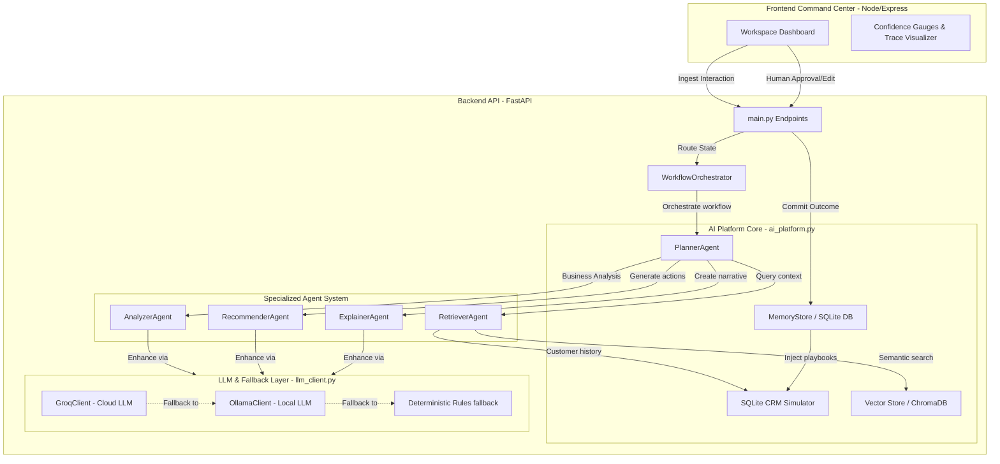

# Decisio-AI Architecture Documentation

Decisio-AI is a premium, enterprise-grade agentic Decision Intelligence platform designed to ingest customer interactions (transcripts, emails, meeting notes), analyze business context, retrieve playbooks, suggest explainable Next-Best-Actions, and learn from human-in-the-loop review loops.

This document describes the high-level architecture, orchestrations, and data flow of the platform.

---

## 1. System Architecture Overview

Decisio-AI follows a decoupled architecture separating the user interface (Node.js/Express) and the intelligence/orchestration core (Python FastAPI).



---

## 2. Platform Components

### 2.1. Frontend Command Center (`frontend/`)
- **Technologies**: Node.js, Express, Vanilla CSS, Web Sockets.
- **Purpose**: Serves the single-page application dashboard. It provides:
  - **Dynamic Ingestion Form**: Supports meeting notes, emails, and conversation transcripts.
  - **Decision Interface**: Displays opportunities, risks, missing information, and evidence citations.
  - **Human-in-the-Loop Gating**: Allows developers or reviewers to approve, edit, or reject recommendations.
  - **Memory & KPI Insights**: Displays continuous learning progress and average health-score lifts over time.
  - **Trace Visualizer**: Renders the executing agent path and step durations for total explainability.

### 2.2. Backend Intelligence Core (`backend/`)
- **Technologies**: Python 3.11, FastAPI, Uvicorn, SQLite, ChromaDB, Sentence-Transformers.
- **Core Orchestration**:
  - `WorkflowOrchestrator`: Manages state machine transitions through:
    `INGESTED` ➔ `PREPROCESSED` ➔ `ANALYZED` ➔ `EXPLAINED` ➔ `WAITING_REVIEW` ➔ `COMPLETED`.
  - `PlannerAgent`: The central coordinator that determines execution pathways and delegates domain operations to specialized agents.

---

## 3. Specialized Agent System

The platform splits execution logic into dedicated, single-responsibility agents:

| Agent | Responsibility | Data / Tools Used |
| :--- | :--- | :--- |
| **RetrieverAgent** | Identifies relevant documents and logs customer timeline. | ChromaDB (Knowledge Base), SQLite (CRM database). |
| **AnalyzerAgent** | Identifies strategic opportunities, critical risks, and missing information. | Playbook rules, Ingestion data, LLM interface. |
| **RecommenderAgent** | Proposes Next-Best-Actions (NBAs) aligned with business rules and past memory. | Local playbooks, Memory weightings, LLM interface. |
| **ExplainerAgent** | Formulates natural-language executive summaries and calculates confidence. | Action rationale, Business KPIs, LLM text generation. |
| **MemoryAgent** | Handles storage/retrieval of learned experiences from approved interaction runs. | SQLite `lessons` and `runs` tables. |

---

## 4. Multi-Tier LLM Provider & Fallback Engine

A core design principle of Decisio-AI is **guaranteed resilience**. The platform remains fully functional even in offline, high-latency, or zero-key environments:

```
[LLM Request]
     │
     ▼
Is LLM_PROVIDER = "groq" and GROQ_API_KEY present?
     ├── Yes ➔ Try Groq API (llama-3.3-70b-versatile)
     │          ├── Success ➔ Return result
     │          └── Failure ➔ Fallback to Ollama
     │
     └── No ➔ Try Ollama (llama3.2 local daemon)
                ├── Success ➔ Return result
                └── Failure ➔ Fallback to Deterministic Rules
```

1. **Tier 1 (Groq API)**: Cloud-hosted LLM wrapper `GroqClient` accessed via the OpenAI-compatible client. Used for ultra-fast reasoning and complex schema generation.
2. **Tier 2 (Ollama)**: Local instance wrapper `OllamaClient` running `llama3.2`. Serves as primary local fallback if internet connectivity is lost or Groq limits are reached.
3. **Tier 3 (Rule-Based Fallback)**: Purely deterministic fallback logic (`_fallback_analysis` and `_fallback_recommendations`) using playbook keyword matching, SQLite CRM lookups, and regex patterns. 

---

## 5. Storage & Closed-Loop Learning

### 5.1. Vector Store (`ChromaDB`)
- Stores playbooks, product documentation, and FAQs.
- Employs `sentence-transformers` for local vector embeddings.
- *Fallback*: If ChromaDB is unavailable, the Retriever employs a TF-IDF + Cosine Similarity fallback to match documents.

### 5.2. CRM & Platform DB (`SQLite`)
- **CRM Simulation**: Tracks customer accounts, contact details, domains, and health status indicators.
- **Run Audit Logs**: Persists every single start, review modification, and state transition.
- **Lessons Learned Table**: When a user approves a recommendation, the specific interaction parameters, playbook IDs, and outcome estimations are written as a "lesson". Future runs load these lessons to dynamically boost or penalize action confidence metrics.
